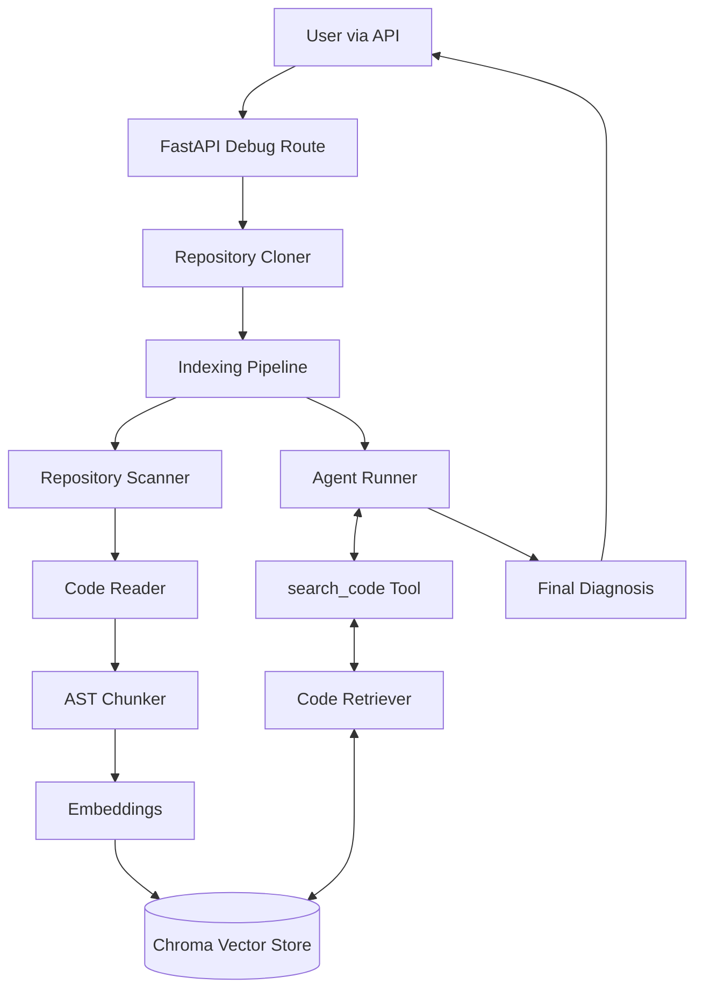

# AI Debugger

The AI Debugger is an intelligent agent designed to autonomously investigate, diagnose, and explain bugs in software repositories. By integrating standard local analysis (AST parsing, code chunking, vector-based semantic search) with an LLM-based autonomous agent, it is able to perform context-aware reasoning on an entire codebase.

This project is built using Python, FastAPI, ChromaDB, and Groq's high-speed inference.

## 1. High-Level Architecture

The system operates using an "Ingest -> Index -> Reason -> Report" pipeline. 



## 2. End-to-End Pipeline

### Repository Ingestion
When a URL is submitted via the `/debug` endpoint, the `RepositoryCloner` validates it (checking for shell injections, valid schemes) and executes a safe `git clone` into an ephemeral temporary directory that guarantees cleanup upon exit.

### Code Indexing
The `IndexingPipeline` scans the cloned repository for `.py` files. It reads, language-detects, and feeds them into the `CodeChunker`. The chunker breaks code down logically via AST (e.g., classes and functions). The chunks are sent to a HuggingFace SentenceTransformer (`CodeEmbedder`) and stored locally in ChromaDB.

### Retrieval
We utilize hybrid search capabilities. The `CodeRetriever` executes semantic search against the local vector store to extract relevant chunks of code. This code is passed through a `RepositoryContextBuilder` which formats it cleanly and applies necessary security boundaries (e.g. marking it as untrusted input).

### Agent Loop and Tool Calling
The core intelligence sits in the `AgentRunner`, an autonomous loop running against the `GroqAgentLLM`. Given the user's bug description, the agent decides which tools to call. Through the `search_code` tool, the agent incrementally queries the `CodeRetriever` and builds context in its memory state. 

Once it is confident in its findings, it stops tool calling and returns the final explanation.

### Evaluation Framework
The project includes a robust evaluation suite (`tests/evaluation/`) capable of grading the agent on multiple metrics: Retrieval Score, Tool Selection, and Diagnosis Accuracy. This suite acts as a constant benchmark against regression.

## 3. How to Run Locally

### Requirements
- Python 3.12+
- Git

### Environment Variables
Create a `.env` file in the root directory:

```env
GROQ_API_KEY=your_groq_api_key_here
HF_TOKEN=your_huggingface_token_here
DATABASE_URL=sqlite:///./backend/test.db
```

### Running the Server

Start the FastAPI application via uvicorn:

```bash
uvicorn backend.app.main:app --reload
```

## 4. API Usage

### Example Request

```bash
curl -X POST "http://localhost:8000/debug/" \
     -H "Content-Type: application/json" \
     -d '{
           "repo_url": "https://github.com/tiangolo/fastapi.git",
           "bug_description": "There is a bug when resolving sub-dependencies in Dependency Injection."
         }'
```

### Example Response

```json
{
  "status": "success",
  "diagnosis": "The bug occurs in `dependencies.py` inside the `solve_dependencies` function. The recursive call incorrectly passes the parent context instead of instantiating a new sub-context...",
  "repository": "https://github.com/tiangolo/fastapi.git",
  "metadata": {
    "input_tokens": 1204,
    "output_tokens": 405,
    "total_tokens": 1609,
    "estimated_cost": 0.0014,
    "iterations": 3,
    "files_indexed": 420,
    "chunks_indexed": 1243
  }
}
```

## 5. Testing

The codebase is fortified with over 150 unit and integration tests. No external internet or API access is required to run the test suite (it dynamically generates local git repositories and mocks LLM endpoints).

```bash
# Run all tests
python -m pytest tests/ -v
```

## Limitations
- Only public git repositories are currently supported via the `/debug` ingestion point.
- The Indexing pipeline is currently restricted to `.py` (Python) files using the `ast` module. Other languages will be ignored.
